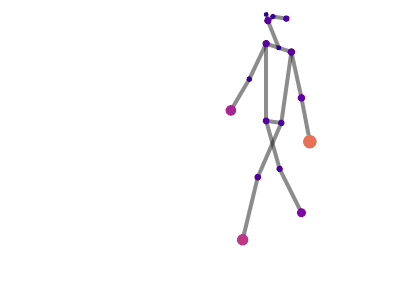
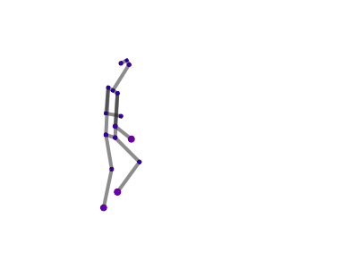

# View-embedding GCN for skeleton-based cross-view gait recognition

<div style="display: flex; justify-content: center; gap: 10px;">
    
    
</div>


## Overview
This repository contains the official PyTorch implementation of the research paper "View-embedding GCN for skeleton-based cross-view gait recognition." The paper explores how to handle the changes in viewpoint and reduce the impact of carried objects and clothing variations on gait recognition.

## Abstract
[Abstract will be added soon]

## Table of Contents
- [Prerequisites](#prerequisites)
- [Installation](#installation)
- [Experiment Details](#experiment-details)
- [Datasets and Codebases ](#datasets-and-codebases)
- [Main Results](#main-results)
- [References](#references)
- [How to Cite](#how-to-cite)


## Prerequisites
- Python >= 3.6
- CUDA >= 10
- GPU


## Installation
1. Clone the repository:
```bash
git clone https://github.com/RayAusrukona/VeMResGCN
cd repository name
```
2. Create a virtual environment and activate it:
```bash
conda create -n environment_name
conda activate environment_name
```
3. Install the required packages:
```bash

install the dependencies from requirements.txt

```


## Experiment Details  

We conducted our experiments using two datasets: **[CASIA-B](http://www.cbsr.ia.ac.cn/english/Gait%20Databases.asp)** and **[OUMVLP-Pose](http://www.am.sanken.osaka-u.ac.jp/BiometricDB/GaitLPPose.html)**.  
Since each dataset has a distinct format, we used separate codebases for training, testing, and validation.  

## Datasets and Codebases  

- **CASIA-B (HRNet)**  
  - [Check CASIA-B Experiment Code](./VeMResGCN_CASIAB/)  

- **OUMVLP-Pose (OpenPose and AlphaPose)**  
  - [Check OUMVLP-Pose Experiment Code](./VeMResGCN_OUMVLP/)  

## Main Results
### CASIA-B
RANK-1 Accuracy (%) per probe angle excluding identical-view cases for the provided models on **CASIA-B** dataset.

|        |    0 |   18 |   36 |   54 |   72 |   90 |   108 |   126 |   144 |   162 |   180 |   mean |
|:-------|-----:|-----:|-----:|-----:|-----:|-----:|------:|------:|------:|------:|------:|-------:|
| NM#5-6 | 87.7 | 92.5 | 92.5 | 94.2   | 93.7 | 90.1 | 89.3 |  88.1 |  88.8 |  90.2 |  85.8 |  90.3 |
| BG#1-2 | 78.3 | 82.6 | 84.4 | 86.9 | 78.8 | 83.0 |  82.8   |  77.5 |  78.4 |  80.7 |  73.7 |   80.7 |
| CL#1-2 | 72.7 | 70.6 | 76.9 | 77.5 | 74.1 | 72.0   |  75.5 |  71.2 |  73.2 |  74.6 |  68.8 |   73.4 |

<!-- The pre-trained model is available [here](google drive link). -->


### OUMVLP-Pose
RANK-1 Accuracy (%) per probe angle excluding identical-view cases for the provided models on **OUMVLP-Pose ** dataset.

|        |    0 |   15 |   30 |   45 |   60 |   75 |   90 |   180 |   195 |   210 |   225 |   240 |   255 |   270 |   mean |
|:-------|-----:|-----:|-----:|-----:|-----:|-----:|------:|------:|------:|------:|------:|-------:|-------:|-------:|-------:|
| OpenPose | 41.6 | 55.8 | 58.6   | 61.7 | 62.1 | 58.5 |  49.4 |  36.3 |  44.2 |  39.8 |  53.8 |   55.2 |   50.2 |   43.6 |   50.8 |
| AlphaPose | 62.7 | 75.0 | 78.1   | 79.7 | 78.8 | 76.4 |  72.0 |  56.5 |  64.6 |  59.6 |  76.1 |   74.4 |   72.3 |   67.3 |   71.0 |


<!-- The pre-trained model is available [here](google drive link). -->


## References
- This repository is based on [GaitGraph](https://github.com/tteepe/GaitGraph) and [GaitGraph2](https://github.com/tteepe/GaitGraph2)


## How to Cite
If you use this paper in your research, please cite it as follows:

```
This will be added soon
```

## License
This will be added soon

## Contact
For any questions or collaborations, please contact [This will be added soon].

